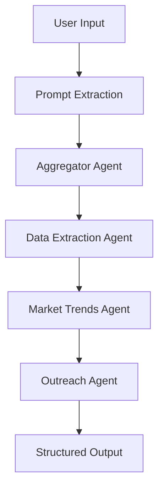

# Sales Agent Co-Pilot - User Guide


**Powered by [SambaNova Cloud](https://cloud.sambanova.ai/)**

## Repository Overview

**Sales Agent Co-Pilot** is an AI-powered sales lead generation platform that combines advanced artificial intelligence with modern web technologies to streamline the sales prospecting process. The platform leverages a multi-agent AI system to identify potential leads, analyze market trends, and generate personalized outreach emails, significantly reducing the time and effort required for sales teams to find and engage with qualified prospects.

### Purpose
- **Automated Lead Generation**: Identify potential sales leads based on specific criteria
- **Market Intelligence**: Provide comprehensive company insights and market trend analysis
- **Personalized Outreach**: Generate tailored email templates for effective communication
- **Efficiency Enhancement**: Streamline the entire sales prospecting workflow

## Architecture Overview

The Sales Agent Co-Pilot is built as a **full-stack application** with a clear separation between backend and frontend components:

### High-Level Architecture
```
┌─────────────────┐    ┌──────────────────┐    ┌─────────────────┐
│   Frontend      │    │     Backend      │    │  External APIs  │
│   (Vue.js 3)    │◄──►│   (FastAPI)      │◄──►│  SambaNova      │
│                 │    │                  │    │  Exa Search     │
│   - UI/UX       │    │   - AI Agents    │    │  Clerk Auth     │
│   - Auth        │    │   - API Routes   │    │                 │
│   - State Mgmt  │    │   - Services     │    │                 │
└─────────────────┘    └──────────────────┘    └─────────────────┘
```

### Component Interaction
1. **Frontend** handles user interactions and authentication
2. **Backend** processes requests through AI agent workflows
3. **External APIs** provide AI capabilities and data sources
4. **Docker containers** ensure consistent deployment across environments

## Technology Stack

### Backend Technologies

| Technology | Version | Purpose |
|------------|---------|---------|
| **FastAPI** | Latest | High-performance web framework for building APIs |
| **CrewAI** | 0.95.0 | Multi-agent AI framework for orchestrating AI workflows |
| **LangChain Community** | 0.3.14 | AI application development framework |
| **Pydantic** | 2.10.5 | Data validation and settings management |
| **Uvicorn** | Latest | ASGI server for running FastAPI applications |
| **Python** | 3.11 | Core programming language |
| **Requests** | Latest | HTTP library for API communications |

### Frontend Technologies

| Technology | Version | Purpose |
|------------|---------|---------|
| **Vue.js** | 3.5.13 | Progressive JavaScript framework for UI |
| **Vue Router** | 4.5.0 | Official router for Vue.js applications |
| **Tailwind CSS** | 3.4.17 | Utility-first CSS framework |
| **Vite** | 6.0.5 | Fast build tool and development server |
| **Axios** | 1.7.9 | Promise-based HTTP client |
| **@clerk/vue** | 1.1.2 | Authentication and user management |
| **@heroicons/vue** | 2.2.0 | Beautiful hand-crafted SVG icons |

### Infrastructure & Deployment

| Technology | Purpose |
|------------|---------|
| **Docker** | Containerization platform |
| **Docker Compose** | Multi-container application orchestration |
| **Nginx** | Reverse proxy and web server |
| **SSL/TLS** | Secure communication protocols |

## AI/ML Components

### Multi-Agent System Architecture

The platform uses **CrewAI** to orchestrate a sophisticated multi-agent system with four specialized agents working in sequence:

#### 1. Aggregator Agent
- **Role**: Aggregator Search Agent
- **Purpose**: Performs initial search queries using the CompanyIntelligenceTool
- **Capabilities**: 
  - Searches based on industry, geography, funding stage, and company stage
  - Retrieves top-level aggregator results from Exa Search API
  - Provides foundational data for subsequent agents

#### 2. Data Extraction Agent
- **Role**: Data Extraction Specialist
- **Purpose**: Extracts and structures detailed company information
- **Capabilities**:
  - Processes raw search results into structured data
  - Extracts company details (name, website, headquarters, funding status)
  - Identifies key contacts and product information
  - Validates and cleans extracted data

#### 3. Market Trends Agent
- **Role**: Market Research Analyst
- **Purpose**: Analyzes market trends and identifies opportunities
- **Capabilities**:
  - Researches relevant market trends for each company
  - Identifies growth opportunities and potential challenges
  - Provides market context for outreach strategies
  - Analyzes competitive landscape

#### 4. Outreach Agent
- **Role**: Outreach Specialist
- **Purpose**: Generates personalized email templates
- **Capabilities**:
  - Creates compelling email subjects and content
  - Personalizes messages based on company data and market trends
  - Incorporates industry-specific insights
  - Optimizes for engagement and response rates

### AI Workflow Process



### Language Model Integration

- **Primary Model**: SambaNova Meta-Llama-3.1-70B-Instruct
- **Configuration**:
  - Temperature: 0.01 (for consistent, focused outputs)
  - Max Tokens: 4096
  - Sequential processing for optimal results

## External APIs

### SambaNova Cloud API
- **Model**: Meta-Llama-3.1-70B-Instruct
- **Purpose**: Powers all AI agents with advanced language understanding
- **Features**:
  - High-quality text generation
  - Structured data extraction
  - Market analysis capabilities
  - Personalized content creation

### Exa Search API
- **Purpose**: Provides company intelligence and market data
- **Capabilities**:
  - Semantic search for company information
  - Real-time data retrieval
  - Category-specific searches
  - Comprehensive company profiles

### Clerk Authentication
- **Purpose**: Secure user authentication and management
- **Features**:
  - OAuth integration
  - Session management
  - User profile handling
  - Security compliance

## Key Features

### 🎯 Targeted Lead Generation
- Generate leads based on specific criteria (industry, geography, funding stage)
- Advanced filtering and search capabilities
- Real-time data processing

### ✍️ AI-Generated Email Templates
- Personalized outreach emails crafted by AI
- Industry-specific messaging
- Optimized subject lines and content

### 💼 Detailed Company Insights
- Comprehensive company information
- Product and service details
- Funding status and key contacts
- Market opportunities and challenges

### 🎤 Voice Search
- Voice-activated search functionality
- Natural language processing
- Hands-free operation

### 📜 Chat History
- Persistent search history
- Previous query tracking
- Easy access to past results

### 📥 JSON Export
- Download search results as JSON files
- Data portability for external analysis
- Integration with other tools

### 🔐 Secure API Key Management
- Client-side API key storage
- Secure transmission protocols
- Privacy-focused architecture

### ⚡ Real-Time Analysis
- Instant lead generation
- Live market data integration
- No processing delays

### 🌐 OAuth Authentication
- Secure login system
- User session management
- Protected data access

## Project Structure

### Backend Directory (`/backend`)

```
backend/
├── Dockerfile                 # Container configuration
├── requirements.txt          # Python dependencies
├── retail_startup.json      # Sample data/configuration
├── agent/                   # AI agent implementations
│   ├── __init__.py
│   └── lead_generation_crew.py  # Core CrewAI agent orchestration
├── api/                     # API endpoints
│   ├── __init__.py
│   └── lead_generation_api.py   # FastAPI application and routes
├── services/                # Business logic services
│   ├── __init__.py
│   ├── company_research_service.py    # Company data processing
│   ├── market_research_service.py     # Market analysis logic
│   └── user_prompt_extractor_service.py  # Input processing
├── tools/                   # AI agent tools
│   ├── __init__.py
│   ├── company_intelligence_tool.py   # Company search tool
│   ├── exa_dev_tool.py               # Exa API integration
│   └── market_research_tool.py       # Market research tool
└── utils/                   # Utility functions
    ├── __init__.py
    └── envutils.py          # Environment configuration
```

#### Key Backend Files

- **`lead_generation_crew.py`**: Core AI agent orchestration using CrewAI framework
- **`lead_generation_api.py`**: FastAPI application with CORS configuration and API endpoints
- **`company_intelligence_tool.py`**: Integration with Exa Search API for company data
- **`user_prompt_extractor_service.py`**: Natural language processing for user inputs

### Frontend Directory (`/frontend/sales-agent-crew`)

```
frontend/sales-agent-crew/
├── Dockerfile              # Container configuration
├── package.json           # Node.js dependencies
├── vite.config.js        # Vite build configuration
├── tailwind.config.js    # Tailwind CSS configuration
├── nginx.conf            # Nginx server configuration
├── index.html            # Main HTML template
├── public/               # Static assets
├── src/                  # Source code
│   ├── main.js          # Application entry point
│   ├── App.vue          # Root Vue component
│   ├── style.css        # Global styles
│   ├── assets/          # Static assets
│   ├── components/      # Reusable Vue components
│   │   ├── CompanyResultCard.vue    # Lead display component
│   │   ├── SearchSection.vue        # Search interface
│   │   ├── SettingsModal.vue        # Configuration modal
│   │   ├── Sidebar.vue              # Navigation sidebar
│   │   └── Header.vue               # Application header
│   ├── views/           # Page components
│   │   ├── HomeView.vue      # Main dashboard
│   │   ├── LoginPage.vue     # Authentication page
│   │   └── MainLayout.vue    # Layout wrapper
│   ├── router/          # Vue Router configuration
│   ├── services/        # API communication
│   └── utils/           # Utility functions
```

#### Key Frontend Files

- **`main.js`**: Application bootstrap with Clerk authentication setup
- **`SearchSection.vue`**: Main search interface with voice recognition
- **`CompanyResultCard.vue`**: Component for displaying lead information
- **`SettingsModal.vue`**: API key configuration interface

## Setup and Installation

### Prerequisites

Before setting up the Sales Agent Co-Pilot, ensure you have the following installed:

- **Node.js** (v14 or above) - [Download](https://nodejs.org/en/)
- **Python** (v3.8 or above) - [Download](https://www.python.org/downloads/)
- **Docker** and **Docker Compose** - [Download](https://www.docker.com/get-started)
- **Git** - [Download](https://git-scm.com/downloads)

### Required API Keys

You'll need to obtain the following API keys:

1. **SambaNova API Key** - [Get Key](https://cloud.sambanova.ai/)
2. **Exa API Key** - [Get Key](https://exa.ai/)
3. **Clerk Publishable Key** - [Get Key](https://clerk.com/)

### Environment Setup

#### 1. Clone the Repository

```bash
git clone https://github.com/yourusername/sales-agent-co-pilot.git
cd sales-agent-co-pilot
```

#### 2. Backend Setup

```bash
cd backend

# Create virtual environment
python3 -m venv venv
source venv/bin/activate  # On Windows: venv\Scripts\activate

# Install dependencies
pip install -r requirements.txt
```

#### 3. Frontend Setup

```bash
cd frontend/sales-agent-crew

# Install dependencies
npm install
```

#### 4. Environment Configuration

Create environment files for configuration:

**Backend** (optional - API keys are passed via headers):
```bash
# backend/.env (optional)
ALLOWED_ORIGINS=http://localhost:5173,http://localhost:5174
```

**Frontend**:
```bash
# frontend/sales-agent-crew/.env
VITE_API_URL=http://localhost:8000
VITE_CLERK_PUBLISHABLE_KEY=your_clerk_publishable_key_here
```

**Docker Compose**:
```bash
# .env (in root directory)
VITE_CLERK_PUBLISHABLE_KEY=your_clerk_publishable_key_here
USE_OFFICIAL_CERTS=false
```

## Usage Instructions

### Running Locally (Development)

#### Option 1: Manual Setup

**Terminal 1 - Backend**:
```bash
cd backend
source venv/bin/activate
uvicorn api.lead_generation_api:create_app --host 127.0.0.1 --port 8000 --reload
```

**Terminal 2 - Frontend**:
```bash
cd frontend/sales-agent-crew
npm run dev
```

Access the application at `http://localhost:5173`

#### Option 2: Docker Development

```bash
# Build and run with docker-compose
docker-compose up --build

# Run in detached mode
docker-compose up -d --build
```

Access the application at `http://localhost` (port 80)

### Production Deployment

#### Docker Deployment

1. **Configure Environment Variables**:
```bash
# Set production environment variables
export VITE_CLERK_PUBLISHABLE_KEY="your_production_clerk_key"
export USE_OFFICIAL_CERTS="true"  # If using SSL certificates
```

2. **Deploy with Docker Compose**:
```bash
docker-compose -f docker-compose.yml up -d --build
```

3. **SSL Configuration**:
   - Place SSL certificates in `/etc/sn-certs/snova.ai/`
   - Certificates should be named `fullchain.pem` and `privkey.pem`
   - Nginx will automatically serve HTTPS on port 443

### API Endpoints

#### Primary Endpoint

**POST** `/generate-leads`

**Headers**:
```
Content-Type: application/json
x-sambanova-key: your_sambanova_api_key
x-exa-key: your_exa_api_key
```

**Request Body**:
```json
{
  "prompt": "Find AI hardware startups in Silicon Valley with Series D funding"
}
```

**Response**:
```json
[
  {
    "company_name": "EdgeAI Tech",
    "website": "www.edgeaitech.com",
    "headquarters": "San Jose, USA",
    "funding_status": "Series D",
    "funding_amount": "$50M",
    "product": "Edge AI Processors",
    "key_contacts": "John Doe (CEO), Jane Smith (CTO)",
    "relevant_trends": "Growing demand for real-time processing",
    "opportunities": "Expansion into wearables and IoT",
    "challenges": "Competition from established players",
    "email_subject": "Driving Edge Computing Innovation",
    "email_body": "Dear EdgeAI Tech team,\n\nAs pioneers in edge computing..."
  }
]
```

### Using the Web Interface

1. **Authentication**: Log in using Clerk OAuth
2. **API Configuration**: Set your SambaNova and Exa API keys in Settings
3. **Search**: Enter your lead generation criteria using text or voice
4. **Review Results**: Browse generated leads with detailed company information
5. **Export Data**: Download results as JSON for external use
6. **History**: Access previous searches from the sidebar

## Authentication

### Clerk OAuth Integration

The platform uses **Clerk** for secure user authentication and session management.

#### Features
- **OAuth Providers**: Support for Google, GitHub, and other providers
- **Session Management**: Automatic session handling and renewal
- **User Profiles**: Comprehensive user profile management
- **Security**: Industry-standard security practices

#### Configuration

1. **Create Clerk Application**:
   - Sign up at [clerk.com](https://clerk.com/)
   - Create a new application
   - Copy the publishable key

2. **Environment Setup**:
```javascript
// frontend/sales-agent-crew/.env
VITE_CLERK_PUBLISHABLE_KEY=pk_test_your_key_here
```

3. **Integration**:
```javascript
// main.js
import { clerkPlugin } from '@clerk/vue'

const app = createApp(App)
app.use(clerkPlugin, { publishableKey: PUBLISHABLE_KEY })
```

#### User Flow
1. User visits the application
2. Redirected to Clerk authentication if not logged in
3. Choose authentication method (OAuth provider)
4. Successful authentication redirects to main application
5. User session maintained across browser sessions

## Deployment

### Docker Container Architecture

The application uses a **multi-container architecture** with Docker Compose:

```yaml
services:
  backend:
    build: ./backend
    ports: ["8000:8000"]
    environment:
      - ALLOWED_ORIGINS=*
    
  frontend:
    build: ./frontend/sales-agent-crew
    ports: ["80:80", "443:443"]
    depends_on: [backend]
    volumes:
      - /etc/sn-certs:/etc/sn-certs
```

### Nginx Reverse Proxy

The frontend container includes **Nginx** configured as a reverse proxy:

#### Features
- **SSL Termination**: Handles HTTPS certificates
- **API Proxying**: Routes `/api/*` requests to backend
- **SPA Support**: Proper routing for Vue.js single-page application
- **Static Asset Serving**: Efficient delivery of frontend assets

#### Configuration Highlights
```nginx
# Redirect HTTP to HTTPS
server {
    listen 80;
    return 301 https://$host$request_uri;
}

# HTTPS server
server {
    listen 443 ssl;
    ssl_certificate /etc/sn-certs/snova.ai/fullchain.pem;
    ssl_certificate_key /etc/sn-certs/snova.ai/privkey.pem;
    
    # Proxy API requests
    location /api/ {
        proxy_pass http://backend:8000/;
        proxy_set_header Host $host;
        proxy_set_header X-Real-IP $remote_addr;
    }
    
    # SPA routing
    location / {
        try_files $uri $uri/ /index.html;
    }
}
```

### Production Considerations

#### Security
- **API Key Management**: Keys stored client-side, transmitted via headers
- **CORS Configuration**: Properly configured for production domains
- **SSL/TLS**: Enforced HTTPS with modern TLS protocols
- **Authentication**: Secure OAuth implementation with Clerk

#### Performance
- **Container Optimization**: Multi-stage Docker builds for smaller images
- **Caching**: Nginx caching for static assets
- **Concurrency**: Multiple Uvicorn workers for backend scaling
- **Async Processing**: ThreadPoolExecutor for CPU-intensive AI tasks

#### Monitoring
- **Health Checks**: Container health monitoring
- **Logging**: Structured logging for debugging
- **Error Handling**: Comprehensive error responses

## Development Guidelines

### Contributing to the Project

#### Getting Started
1. **Fork the Repository**: Create your own fork on GitHub
2. **Clone Locally**: `git clone https://github.com/yourusername/sales-agent-co-pilot.git`
3. **Create Branch**: `git checkout -b feature/your-feature-name`
4. **Install Dependencies**: Follow setup instructions above

#### Code Structure

##### Backend Development
- **Follow FastAPI Patterns**: Use dependency injection and async/await
- **Agent Development**: Extend CrewAI agents in `/backend/agent/`
- **Service Layer**: Business logic in `/backend/services/`
- **Tool Integration**: New AI tools in `/backend/tools/`

##### Frontend Development
- **Vue 3 Composition API**: Use modern Vue.js patterns
- **Component Structure**: Reusable components in `/src/components/`
- **State Management**: Use Vue's reactive system
- **Styling**: Tailwind CSS utility classes

#### Code Quality Standards

##### Python (Backend)
```python
# Use type hints
def extract_lead_info(self, prompt: str) -> dict:
    """Extract structured information from user prompt."""
    pass

# Follow PEP 8 style guide
# Use Pydantic models for data validation
class Outreach(BaseModel):
    company_name: str
    website: str
    headquarters: str
```

##### JavaScript/Vue (Frontend)
```javascript
// Use ES6+ features
const searchLeads = async (prompt) => {
  try {
    const response = await axios.post('/api/generate-leads', { prompt })
    return response.data
  } catch (error) {
    console.error('Search failed:', error)
    throw error
  }
}

// Vue 3 Composition API
<script setup>
import { ref, computed } from 'vue'

const searchQuery = ref('')
const isLoading = ref(false)
</script>
```

### Extending Functionality

#### Adding New AI Agents

1. **Create Agent Class**:
```python
# backend/agent/new_agent.py
from crewai import Agent

class NewAgent:
    def __init__(self, llm):
        self.agent = Agent(
            role="Your Agent Role",
            goal="Agent's specific goal",
            backstory="Agent's background",
            llm=llm
        )
```

2. **Integrate with Crew**:
```python
# backend/agent/lead_generation_crew.py
def _initialize_agents(self):
    # Add your new agent
    self.new_agent = NewAgent(self.llm)
```

#### Adding New API Endpoints

1. **Create Endpoint**:
```python
# backend/api/lead_generation_api.py
@self.app.post("/new-endpoint")
async def new_endpoint(request: Request):
    # Implementation
    return JSONResponse(content=result)
```

2. **Frontend Integration**:
```javascript
// frontend/src/services/api.js
export const callNewEndpoint = async (data) => {
  const response = await axios.post('/api/new-endpoint', data)
  return response.data
}
```

#### Adding New UI Components

1. **Create Component**:
```vue
<!-- frontend/src/components/NewComponent.vue -->
<template>
  <div class="new-component">
    <!-- Component template -->
  </div>
</template>

<script setup>
// Component logic
</script>

<style scoped>
/* Component styles */
</style>
```

2. **Register and Use**:
```vue
<!-- In parent component -->
<script setup>
import NewComponent from '@/components/NewComponent.vue'
</script>

<template>
  <NewComponent />
</template>
```

### Testing Guidelines

#### Backend Testing
```python
# tests/test_agents.py
import pytest
from backend.agent.lead_generation_crew import ResearchCrew

def test_research_crew_initialization():
    crew = ResearchCrew("test_key", "test_key")
    assert crew.llm is not None
    assert len(crew.agents) == 4
```

#### Frontend Testing
```javascript
// tests/components/SearchSection.test.js
import { mount } from '@vue/test-utils'
import SearchSection from '@/components/SearchSection.vue'

describe('SearchSection', () => {
  it('renders search input', () => {
    const wrapper = mount(SearchSection)
    expect(wrapper.find('input[type="text"]').exists()).toBe(true)
  })
})
```

### Performance Optimization

#### Backend Optimization
- **Async Processing**: Use ThreadPoolExecutor for AI tasks
- **Caching**: Implement Redis for frequently accessed data
- **Database**: Consider PostgreSQL for persistent storage
- **Monitoring**: Add APM tools like New Relic or DataDog

#### Frontend Optimization
- **Code Splitting**: Use Vue Router lazy loading
- **Asset Optimization**: Optimize images and bundle size
- **Caching**: Implement service worker for offline capability
- **Performance Monitoring**: Use tools like Lighthouse

### Troubleshooting

#### Common Issues

**Backend Issues**:
- **Import Errors**: Check Python path configuration
- **API Key Errors**: Verify headers are properly set
- **CORS Issues**: Check ALLOWED_ORIGINS configuration

**Frontend Issues**:
- **Build Failures**: Clear node_modules and reinstall
- **Authentication Issues**: Verify Clerk configuration
- **API Connection**: Check VITE_API_URL environment variable

**Docker Issues**:
- **Build Failures**: Check Dockerfile syntax and dependencies
- **Port Conflicts**: Ensure ports 80, 443, 8000 are available
- **Volume Mounting**: Verify certificate paths exist

#### Debug Mode

**Backend Debug**:
```bash
# Run with debug logging
uvicorn api.lead_generation_api:create_app --host 127.0.0.1 --port 8000 --reload --log-level debug
```

**Frontend Debug**:
```bash
# Run with verbose output
npm run dev -- --debug
```

---

## Support and Resources

### Documentation Links
- [FastAPI Documentation](https://fastapi.tiangolo.com/)
- [Vue.js 3 Guide](https://vuejs.org/guide/)
- [CrewAI Documentation](https://docs.crewai.com/)
- [SambaNova Cloud API](https://cloud.sambanova.ai/docs)
- [Exa Search API](https://docs.exa.ai/)
- [Clerk Authentication](https://clerk.com/docs)

### Community and Support
- **GitHub Issues**: Report bugs and request features
- **Discussions**: Community discussions and Q&A
- **Contributing**: See CONTRIBUTING.md for guidelines

### License
This project is licensed under the MIT License - see the [LICENSE.md](LICENSE.md) file for details.

---

**Thank you for using Sales Agent Co-Pilot!** 

For questions, issues, or contributions, please visit our [GitHub repository](https://github.com/yourusername/sales-agent-co-pilot) or contact the maintainers.
